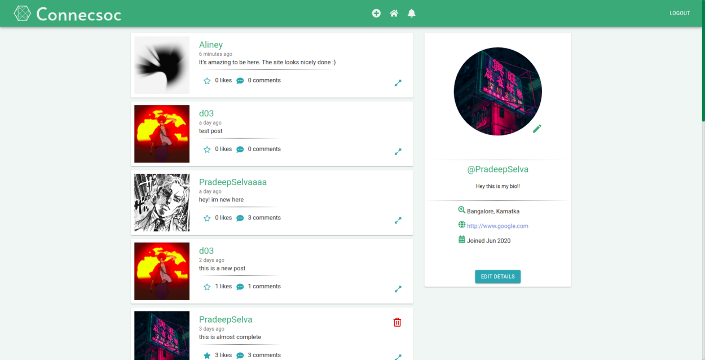

# Connecsoc
* A social media website powered by react, redux, firebase and typescript.
* Join the site, make an account and post things for the rest of the users to see.
* The backend uses firebase-auth and cloud firestore along with express.
* [Visit site!](https://connecsoc.web.app/)

## Built using
* React
* React router
* Typescript
* Redux
* Redux Thunk
* Material UI
* Firebase
* Express
* Node
* TSX
* CSS
* Javascript

## Getting started

Install all dependencies with `npm install` (or) `yarn install` and run it with `npm start` (or) `yarn start`

